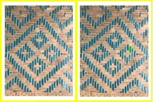

4. The script will load the two input images, calculate the SSIM, and generate visual outputs.
5. The "Original" window will display the first input image.
6. The "Modified" window will display the second input image.
7. The "Diff" window will display the difference image, highlighting differing regions.
8. The "Thresh" window will display the thresholded difference image.

## Compatibility

This script requires the OpenCV library and Python installed on your system.

## Screenshots

*Fig. 1: The Image Difference Comparator in action, showing original images, difference image, and thresholded difference image.*

## Contact

For any inquiries or feedback regarding the Image Difference Comparator script, please feel free to contact the developer:

Name: Morteza Hatami
Email: m.hatami@live.com
